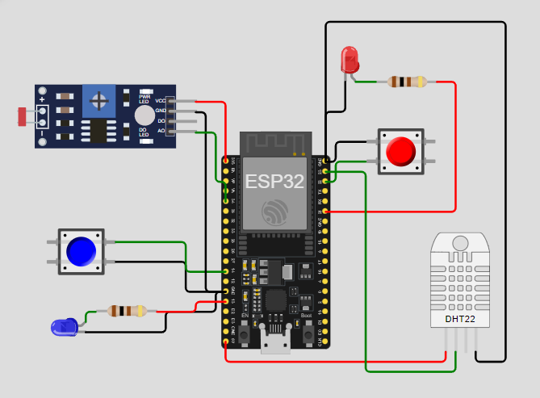
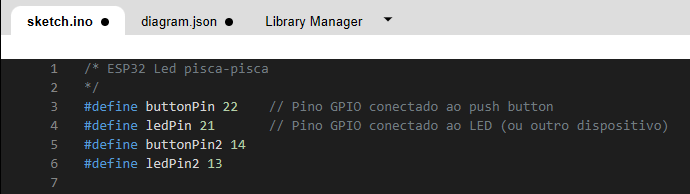

# Desafio Máquina Agrícola

## Descrição Geral

Este projeto simula um sistema de irrigação inteligente para agricultura de precisão, integrando sensores físicos (simulados) a um microcontrolador ESP32. O objetivo é coletar dados de sensores de umidade, nutrientes e pH, controlar uma bomba de irrigação (relé/LED) e armazenar os dados em um banco de dados SQL para análise posterior.

---

## 1. Montagem do Circuito no Wokwi

O circuito foi montado na plataforma [Wokwi](https://wokwi.com/), utilizando os seguintes componentes:

- **ESP32 DevKit**
- **Botão vermelho:** Simula sensor de fósforo (P)
- **Botão azul:** Simula sensor de potássio (K)
- **LDR (Light Dependent Resistor):** Simula sensor de pH (variação analógica)
- **DHT22:** Sensor de umidade e temperatura do solo
- **LEDs:** Indicadores de presença de fósforo e potássio
- **Relé/LED:** Simula bomba de irrigação

### Imagem do Circuito

---

## 2. Lógica de Funcionamento

### Sensores Simulados

- **Sensor de Fósforo (P):**  
  Representado por um botão físico.  
  - Pressionado = presença de fósforo (LED vermelho aceso)
  - Solto = ausência de fósforo (LED vermelho apagado)

- **Sensor de Potássio (K):**  
  Representado por outro botão físico.  
  - Pressionado = presença de potássio (LED azul aceso)
  - Solto = ausência de potássio (LED azul apagado)

- **Sensor de pH:**  
  Simulado por um LDR.  
  - O valor lido do LDR representa o pH do solo (quanto mais luz, maior o valor).

- **Sensor de Umidade do Solo:**  
  Utiliza o DHT22 para ler a umidade e temperatura do solo.

- **Relé/LED:**  
  Simula a bomba de irrigação.  
  - Aciona automaticamente conforme a lógica definida (exemplo: umidade abaixo de um limite).

### Fluxo de Controle

1. O ESP32 lê todos os sensores a cada ciclo do loop.
2. Os valores dos sensores são enviados para o monitor serial.
3. O relé (LED) é acionado/desligado automaticamente conforme a lógica:
   - Exemplo: se a umidade estiver abaixo de 40%, a bomba é ligada.
4. Os dados do monitor serial são copiados e armazenados em um banco de dados SQLite via script Python.

---

## 3. Código do ESP32

O código-fonte do ESP32 está disponível na pasta [src](src/) no arquivo [logicaEsp32.ino](src/logicaEsp32.ino).  
O código está comentado, explicando a lógica de leitura dos sensores, acionamento do relé e envio dos dados para o monitor serial.

---

## 4. Armazenamento dos Dados em Banco de Dados SQL

Os dados lidos do monitor serial são copiados e armazenados em um banco de dados SQLite (`agro.db`) usando um script Python.  
O script realiza as operações CRUD (Create, Read, Update, Delete) na tabela `Dados_Lavoura`.

### Estrutura da Tabela

| id | ldr (pH) | umidade | temperatura |
|----|----------|---------|-------------|
| 1  |   7.49   |  59.00  |   23.00     |
| 2  |   8.83   |  33.00  |   28.00     |
| 3  |   8.67   |  58.00  |   29.00     |
| 4  |   6.97   |  30.00  |   29.00     |

- **id:** Identificador único do registro.
- **ldr (pH):** Valor analógico do LDR, simulando o pH do solo.
- **umidade:** Valor de umidade do solo lido pelo DHT22.
- **temperatura:** Temperatura do solo lida pelo DHT22.

### Justificativa da Estrutura

A estrutura do banco foi baseada no MER da fase anterior, garantindo que cada leitura de sensores seja registrada com seus respectivos valores, permitindo análises históricas e estatísticas. Cada campo representa um sensor do circuito, conforme modelagem da Fase 2.

---

## 5. Operações CRUD

O sistema Python implementa as seguintes operações:

- **Inserção:**  
  Adiciona novos dados lidos dos sensores.

- **Consulta:**  
  Permite visualizar todos os dados armazenados.

- **Atualização:**  
  Permite alterar valores de umidade de um registro específico.

- **Remoção:**  
  Permite excluir registros do banco.

- **Limpar tabela:**  
  Remove todos os registros da tabela (opção disponível no menu).

Todas as operações possuem tratamento de erros e mensagens claras para o usuário.

---

## Instruções de como rodar o Projeto Máquina Agrícola

- Clone o projeto para pasta local: 
  
  - *Opção 1*: Rodar o protótipo do Esp32 diretamente no VSCode: após abrir o projeto é necessário possuir extensão PlatformIO. Antes de fazer o build é necessário possuir uma licença do site wokwi [licença](https://wokwi.com/license). Em seguida realizar o buid do projeto. Após isso é necessário dar play para que seja gerado logs. Copie esses logs e os insira no arquivo [modelagem.txt](Database/modelagem.txt). Este arquivo é usado na entidade db_service para inserir os dados na tabela Lavoura.
  
  - *Opção 2*: Rodar o protótipo no site Wokwi: Ao abri o site [Wokwi](https://wokwi.com/) e clicar em ESP32 e abrir o primeiro starter template é necessário copiar o código no arquivo [logicaEsp32.ino](src/logicaEsp32.ino)
  e colocar na aba sketch.ino após isso é necessário copiar o código do arquivo [diagram](/diagram.json) e colocar na aba diagram e apertar play para que gere os logs no Monitor Serial. 
  . Copie esses logs e os insira no arquivo [modelagem.txt](Database/modelagem.txt). Este arquivo é usado na entidade db_service para inserir os dados na tabela Lavoura.

- Inicialmente já háverá dados no arquivo [modelagem.txt](Database/modelagem.txt), porem sintasse à vontade para acrescentar outros dados, ou remover os atuais e substituí-los, com os novos gerados. 

- A tabela do banco de dados estará em branco, caso queria limpá-la novamente a opção 5 da interface estará disponível.

- É possível consultar os dados inseridos na tabela, editar e remover os mesmos.

- Use o comando 'python terminal_interface.py' para utilizar a interface do projeto no terminal.